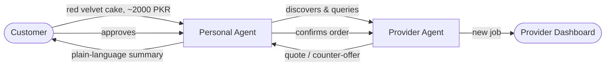

# Taiz AI

**Your personal AI for local services — agents that negotiate on your behalf.**


Taiz gives everyday requests — a custom cake, a repair, a booking — their own AI agent. You describe what you need once; your agent finds and negotiates with providers on your behalf and brings you a plain-language deal to approve. This repo contains the interactive product prototype: a fully designed, end-to-end demo of that experience.

## Table of Contents

- [The Problem](#the-problem)
- [The Idea](#the-idea)
- [How It Works](#how-it-works)
- [Demo Walkthrough](#demo-walkthrough)
- [Project Status](#project-status)
- [Screens & Routes](#screens--routes)
- [Tech Stack](#tech-stack)
- [Project Structure](#project-structure)
- [Getting Started](#getting-started)
- [Roadmap](#roadmap)
- [Deliberate Trade-offs](#deliberate-trade-offs)
- [Contributing](#contributing)

## The Problem

Finding a local provider who can actually fulfil a specific, time-boxed request — a custom cake by tomorrow afternoon, nearby, within budget — usually means manually calling around. Availability is fragmented per-branch, per-day, and per-order in a way no existing aggregator captures well.

## The Idea

Taiz gives each side — customer and provider — a personal agent. The customer states their need once; their agent queries multiple provider agents in the area at the same time and returns a compared, human-readable set of options (price, timing, rating), plus a plain-text negotiation log so the agent-to-agent conversation stays inspectable rather than a black box.

The current demo scenario — ordering a cake from a bakery — was chosen because the pain is universal and easy to grasp on first look. Bakeries are the proof of the pattern, not the product: the same agent protocol is meant to generalize to any fragmented local service.

## How It Works



1. **State your need** (`#/chat`) — tell your personal agent what you want.
2. **Agent goes to work** (`#/magic`) — it discovers nearby providers and opens negotiations, shown live as a terminal feed and node graph.
3. **Watch the negotiation** (`#/negotiation`, `#/agent-chat-log`) — follow the back-and-forth in real time, down to the literal transcript between the two agents.
4. **Review before committing** (`#/review`) — the agent hands you a plain-language summary of the deal. Nothing books without you.
5. **Approve the final offer** (`#/approval`) — confirm the counter-offer.
6. **Booked** (`#/confirmed`) — pickup time and location are set.
7. **On the other side** (`#/provider`, `#/provider-explore`, `#/provider-negotiation`) — the provider sees the confirmed job the instant it's booked, and their own agent working the incoming request queue in the background.

## Demo Walkthrough

The default script (`frontend/src/lib/agent.ts`) plays out a complete negotiation:

- Customer **Ayesha Khan** wants a **Red Velvet Cake**, budget **2,000 PKR**.
- Her agent finds **Grand Central Bakery** (4.8★) — initial quote **3,500 PKR**, negotiated down to **2,200 PKR**.
- Ayesha reviews the agent's summary and approves the counter-offer; the order is confirmed for pickup today at 2:00 PM.
- The provider dashboard receives the new confirmed job the moment it's booked.

The story, pricing, and timing are all defined in one place (`DEMO` and `TIMINGS` in [`agent.ts`](frontend/src/lib/agent.ts)) and easy to retune.

## Project Status

Taiz is at the **interactive prototype** stage — built to demonstrate the product experience, not yet the underlying agent network.

- ✅ **Frontend** ([`frontend/`](frontend/)) — complete. Every screen in the flow above is built, routed, and wired to shared state with a fully scripted demo that plays start to finish. This runs entirely client-side: the "negotiation" is a timed script, not a network call. State (role, active request, provider jobs) persists to `localStorage`, so customer and provider views stay in sync across tabs.
- 🚧 **Backend** ([`backend/`](backend/)) — scaffolded only. It's a bare Bun entrypoint with no Directory Worker, provider agents, or A2A protocol implementation yet. Turning the scripted flow into real agent-to-agent traffic is the next major milestone — see [Roadmap](#roadmap).

## Screens & Routes

**Customer**

| Route | Screen | Purpose |
| --- | --- | --- |
| `#/welcome` | Welcome | Role selection (Customer / Provider) |
| `#/dashboard` | Request Dashboard | Task dashboard; chips relaunch the demo |
| `#/chat` | Agent Chat | Chat with your personal agent |
| `#/magic` | Magic View | Discovery & negotiation animation (terminal + node graph) |
| `#/negotiation` | Negotiation Status | Live negotiation timeline, auto-advancing |
| `#/agent-chat-log` | Agent Chat Log | Full agent-to-agent negotiation transcript |
| `#/activity` | Activity | Running lifecycle log for the active request |
| `#/history` | History | Confirmed / declined past orders |
| `#/review` | Human Review | Human approval of the agent's summary |
| `#/approval` | Offer Approval | Final counter-offer approval |
| `#/confirmed` | Order Confirmation | Booking confirmed |

**Provider**

| Route | Screen | Purpose |
| --- | --- | --- |
| `#/provider` | Provider Dashboard | Jobs dashboard |
| `#/provider-negotiation` | Provider Negotiation | Provider's agent working in the background |
| `#/provider-explore` | Provider Explore | Nearby incoming requests the agent can pick up |
| `#/provider-profile` | Provider Profile | Identity, stats, AI Agent toggle, sign out |

The full flow is replayable end-to-end and resumes mid-flow after a refresh.

## Tech Stack

| Layer | Choice |
| --- | --- |
| Runtime & tooling | [Bun](https://bun.sh) 1.3+ |
| UI | React 19 + TypeScript |
| Styling | Tailwind CSS v4 (compiled via `bun-plugin-tailwind`), shadcn-style primitives, Radix UI |
| Icons / Type | lucide-react · Hanken Grotesk (UI) · JetBrains Mono (terminal/data) |
| Routing | Custom hash router (`lib/router.ts`) — no external router dependency |
| State | React Context + reducer, persisted to `localStorage` (`taiz:state`) |
| Hosting target | Cloudflare Pages (frontend) · Cloudflare Workers (backend, planned) |
| Backend (planned) | HonoJS on Cloudflare Workers, Cloudflare D1, A2A (Agent2Agent) protocol over JSON-RPC 2.0 |

The desktop view renders the app inside a simulated phone frame (`DeviceFrame`) alongside a desktop header, so the same build demos cleanly on a projector or a real phone.

## Project Structure

```
taiz/
├── frontend/                # Interactive demo — fully built
│   ├── src/
│   │   ├── screens/         # 15 screens across the customer + provider flows
│   │   ├── components/      # layout/, shared/, ui/ (shadcn-style primitives)
│   │   ├── state/           # AppContext (reducer) + shared types
│   │   ├── lib/             # hash router, demo script, utils
│   │   ├── index.html       # entry HTML
│   │   ├── index.ts         # Bun.serve dev/prod server
│   │   └── frontend.tsx     # React root
│   ├── styles/globals.css   # design tokens
│   ├── build.ts             # production bundle (Bun.build + Tailwind plugin)
│   └── wrangler.toml        # Cloudflare Pages config
├── backend/                  # Cloudflare Worker scaffold — not yet implemented
│   └── index.ts
└── README.md
```

## Getting Started

**Prerequisite:** [Bun](https://bun.sh) 1.3+

```bash
git clone https://github.com/Mahad-lab/taiz.git
cd taiz/frontend
bun install
bun dev
```

Open **http://localhost:3000** and pick a role on the welcome screen to start the flow.

Other commands (run from `frontend/`):

```bash
bun run build       # production bundle -> frontend/dist
bun start            # serve the production build
bunx tsc --noEmit    # typecheck
```

`backend/` installs (`bun install`) but has nothing to run yet.

## Roadmap

The planned architecture replaces the scripted demo with a real agent network:

- **Directory Worker** — a Cloudflare Worker that indexes provider agents and answers discovery queries.
- **Provider agents** — each provider runs as its own Cloudflare Worker exposing an [A2A (Agent2Agent)](https://github.com/google/A2A) Agent Card at `/.well-known/agent.json` and a JSON-RPC 2.0 task lifecycle (`submitted → working → input-required → completed/failed`).
- **Personal agent fan-out** — parallel queries to multiple provider agents (`Promise.allSettled`) with per-agent timeouts, aggregating comparable results across price, availability, lead time, distance, and dietary fit.
- **Cloudflare D1** — persistent storage for providers, requests, and negotiation history, replacing the current `localStorage`-only state.
- **Installability** — a manifest and service worker so the app can be added to a home screen, not just used responsively in a browser.

## Deliberate Trade-offs

A few scope decisions were made intentionally rather than by omission:

- **Responsive web, not native.** No install friction, no app-store review cycle, and it runs from a single URL — appropriate since the differentiator is the agent protocol, not platform integration. Trade-off: no background execution or push notifications while the tab is closed.
- **Negotiation log instead of end-to-end encryption.** Every agent exchange is written out as a human-readable, line-by-line transcript rather than hidden behind a hand-rolled or partially-implemented crypto layer. Real E2E design is left for post-prototype work rather than shipped half-built.
- **Structured input over NLP.** Requests go through a guided flow instead of free-text intent parsing — less flexible, but it reliably works live.

## Contributing

This is a two-package layout with no root `package.json` — work inside `frontend/` or `backend/` directly. Please typecheck before pushing:

```bash
cd frontend && bunx tsc --noEmit
```
